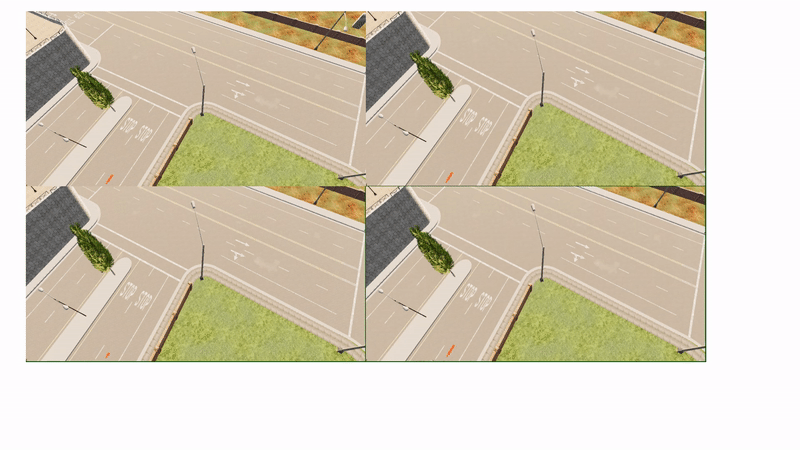

# Autonomous Vehicle Navigation in CARLA Simulator

A project that demonstrates how self-driving cars can automatically make turns and perform overtaking maneuvers in the CARLA simulator. The navigation system uses Bézier curves to create smooth driving paths.

## What This Project Does

- Makes autonomous left and right turns at intersections
- Performs safe overtaking maneuvers around slower vehicles
- Works in both empty cities and cities with other vehicles
- Demonstrates basic autonomous driving capabilities

## System Requirements

- Windows 10
- CARLA Simulator version 0.9.11
- Python with these packages:
  - numpy
  - opencv
  - pygame

## Installation Steps

1. Get CARLA:
   - Go to [CARLA Releases](https://github.com/carla-simulator/carla/releases)
   - Download "[Windows] CARLA 0.9.11"
   - Extract the zip file
   - Rename the folder to `CARLA_0.9.11`

2. Get this project:
   - Download or clone this repository
   - Put it in the same folder as `CARLA_0.9.11`

## How to Run the Project

### Step 1: Start CARLA
Open a command prompt and run:
```bash
cd CARLA_0.9.11
./CarlaUE4.sh -quality-level=Low
```

### Step 2: Choose Your Scenario

#### For Basic Turning Practice (No Traffic):
```bash
python ego_vehicle.py
```

#### For City Driving with Other Cars:
```bash
# First terminal:
python ego_vehicle.py

# Second terminal:
cd CARLA_0.9.11/WindowsNoEditor/PythonAPI/examples
python spawn_npc.py -n 80   # This adds 80 other cars
```

#### For Testing Overtaking:
```bash
python ego_vehicle.py -s 1
```
Important: The overtaking feature is still in testing. For best results, use it in an empty city without other vehicles.

## See It in Action

Here's how the autonomous vehicle performs turns:


And here's the overtaking maneuver:


## Having Problems?

Common issues and solutions:
- If CARLA won't start: Make sure you have enough disk space and a dedicated graphics card
- If Python gives errors: Check that you've installed all required packages
- If the car behaves strangely: Try running in the empty city first

## Get Involved

This is an open project and we welcome contributions! Whether you want to improve the turning logic, make overtaking more reliable, or add new features, feel free to join in.   
***Note: Overtaking is still experimental and might fail in heavy traffic environment. Do not spawn vehicles for overtaking***


